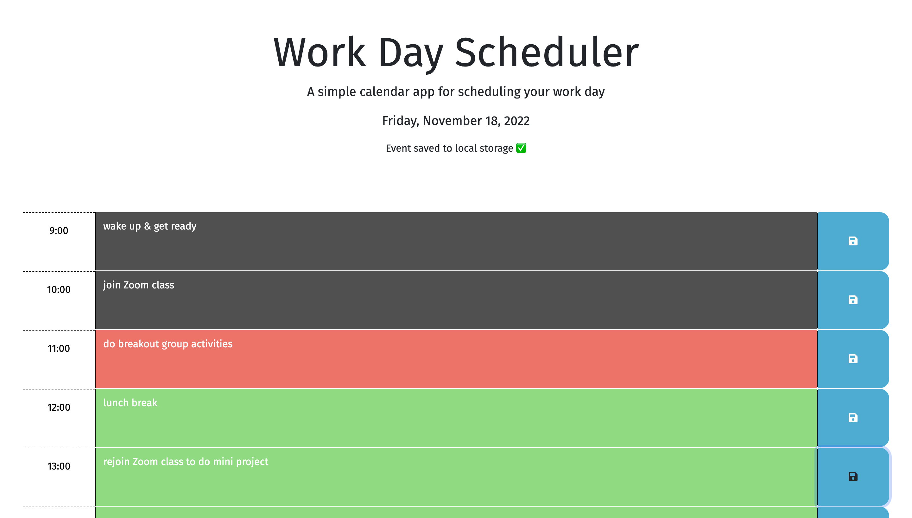

# Module 5 Challenge: Work Day Scheduler

## Description

This work day scheduling application was built to allow users to add and save important events to each time block from 9:00 to 19:00 every day in order to enhance time management.

## Usage

To use this application, type in the corresponding time block to add events then click the save button to keep the events even after reloading or reopening the page. As a visual reference, the time blocks are also color-coded with different statuses, with red indicating the present, green indicating the future, and gray indicating the past. 

## Link to Deployed Application
https://nbtrieu.github.io/day-scheduler/